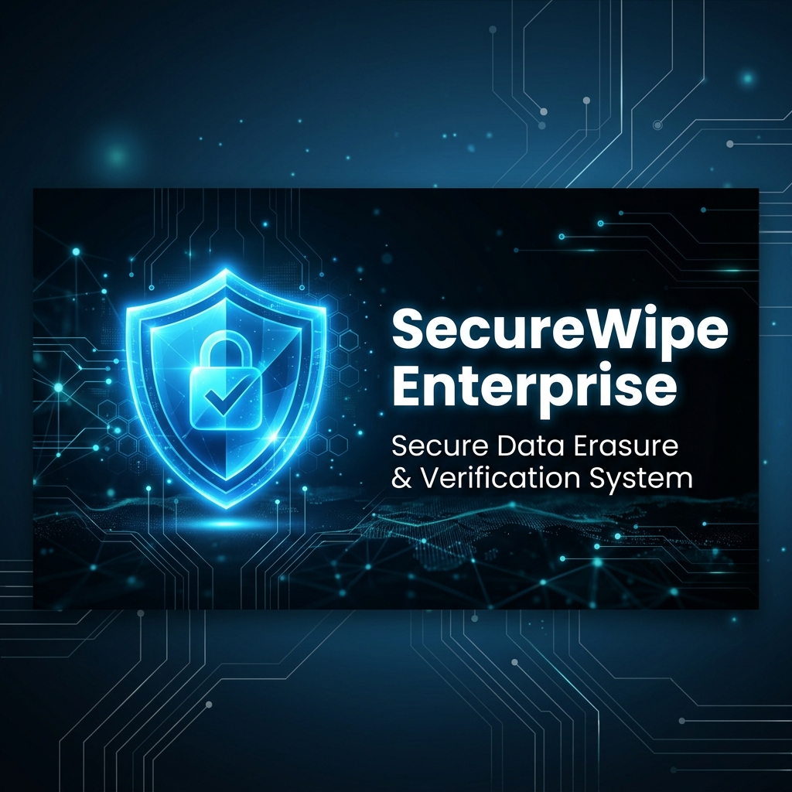
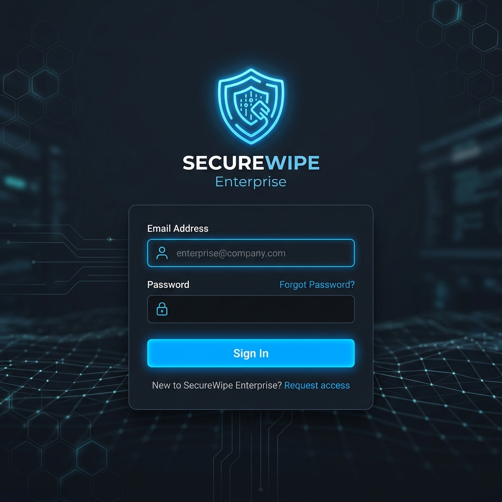
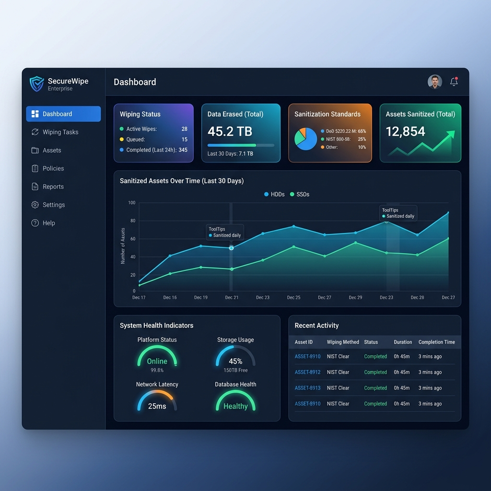
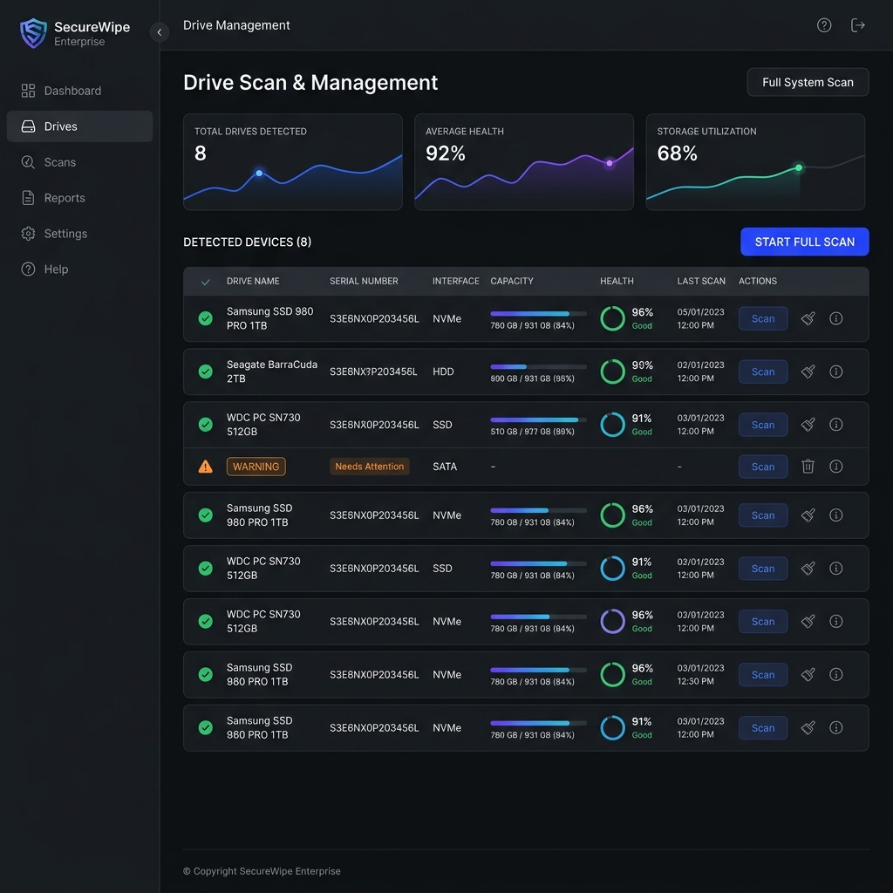
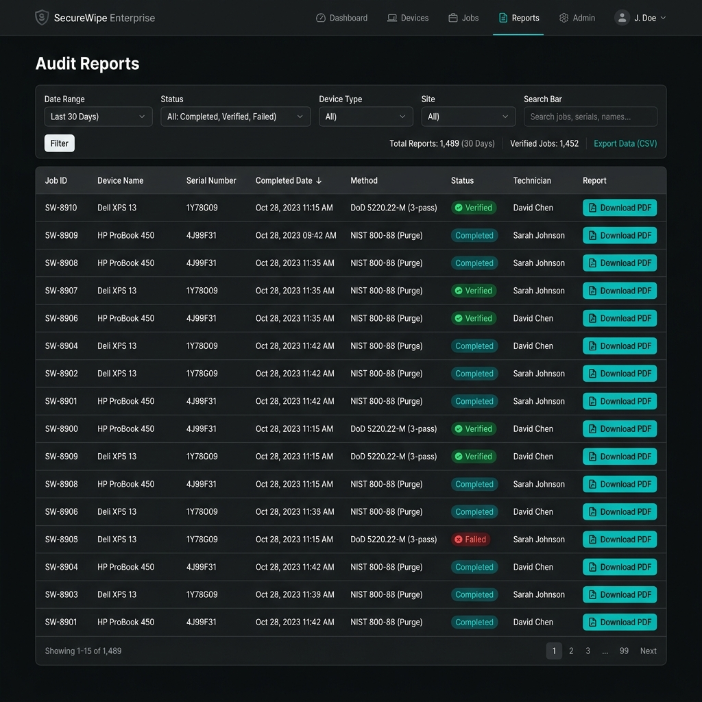
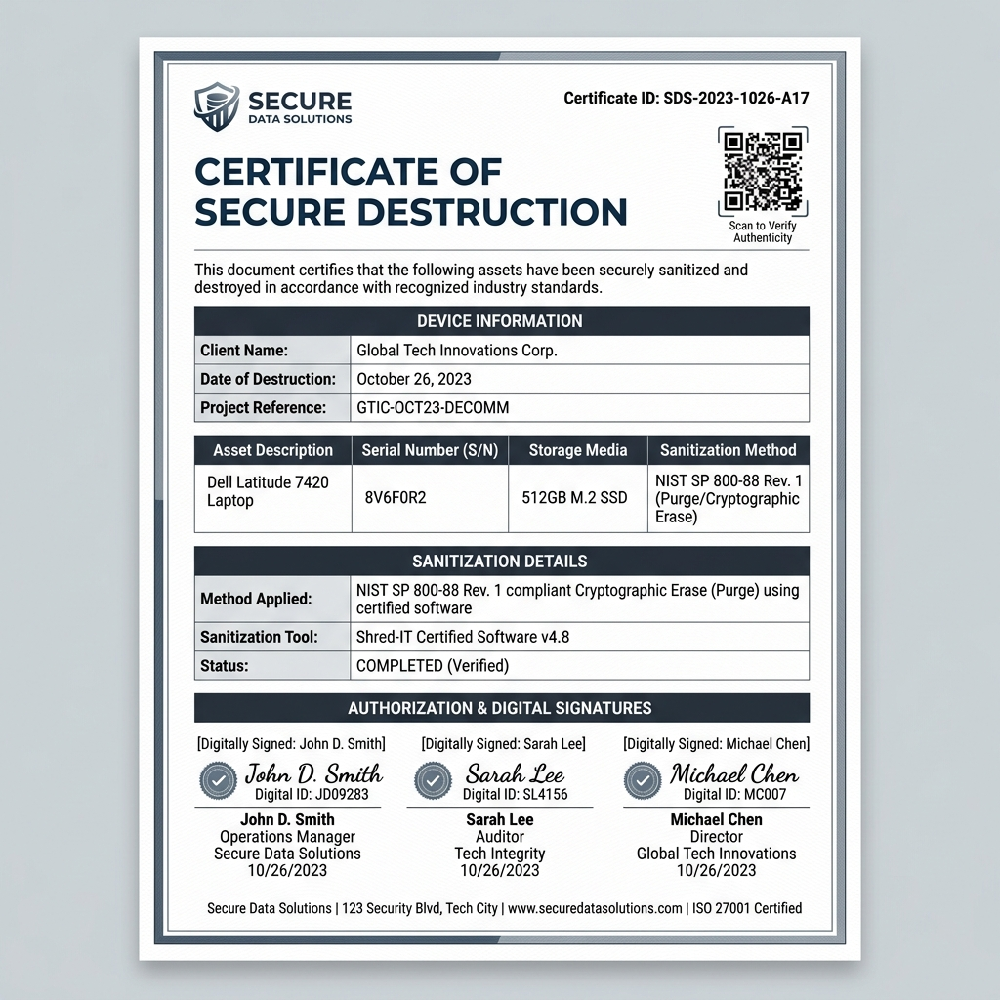
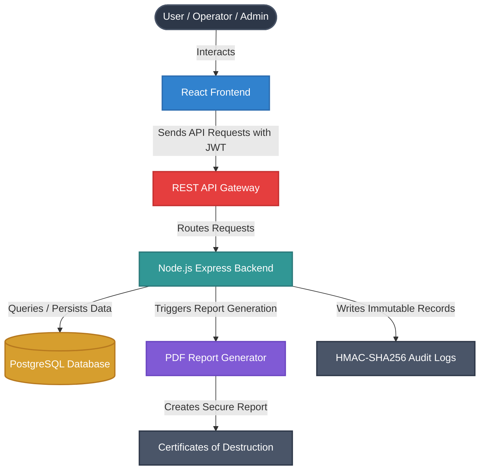
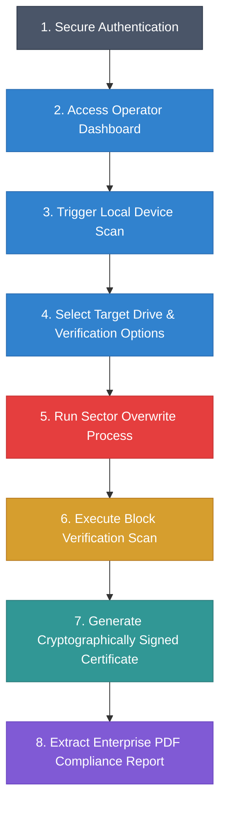

# SecureWipe Enterprise

### Enterprise Secure Data Erasure & Verification System

---

<p align="center">
  
  
  
  
  
</p>

<p align="center">
  <a href="https://github.com/Jo2thshana/SecureWipe-Enterprise/releases"></a>
  <a href="https://github.com/Jo2thshana/SecureWipe-Enterprise/commits/main"></a>
  <a href="https://github.com/Jo2thshana/SecureWipe-Enterprise/stargazers"></a>
  <a href="https://github.com/Jo2thshana/SecureWipe-Enterprise/network/members"></a>
  <a href="https://github.com/Jo2thshana/SecureWipe-Enterprise/issues"></a>
</p>

## 📋 Project Overview

**SecureWipe Enterprise** is a web-based data sanitization and verification system configured for local development and testing. It is designed for corporate IT recycling, security audits, and systems management teams.

### Why SecureWipe was Developed
When standard storage drives are discarded or reused, formatting them is not enough. Standard formatting only removes pointers to files, leaving the actual files on the drive where anyone can recover them. This creates severe security risks, including leaked customer data, financial records, or private employee files.

### The Problem it Solves
SecureWipe Enterprise overwrites storage drives block-by-block using industry standards (like NIST SP 800-88 and DoD 5220.22-M). Once the drive is overwritten, the system checks the sectors to make sure no data is left behind, and automatically creates a PDF certificate to prove the drive has been safely cleared.

---

## 🎯 Key Highlights

*   **Secure Data Erasure:** Full drive cleaning based on NIST SP 800-88 standards.
*   **Enterprise Dashboard:** Simple and clean control center for data operations.
*   **Device Detection & Management:** Scans connected drives and protects the system drive from accidental erasure.
*   **PDF Reports & Certificates:** Instantly downloads official Certificates of Destruction.
*   **PostgreSQL Database:** Sturdy relational storage for operational records.
*   **JWT Authentication:** Secure token-based logins.
*   **Role-Based Access Control (RBAC):** Separates admin settings from operational workflows.
*   **Audit Logs:** Records all system actions to track operational history.
*   **QR Code Verification:** Scan printed certificates to check details instantly.
*   **Clean Architecture:** Organizes components for simple updates.
*   **Modern Tech Stack:** React, Node.js, Express, and Tailwind CSS.

---

## 🎯 Project Objectives

*   **Secure Data Erasure:** Fully erase storage devices to prevent data leakage.
*   **Prevent Data Recovery:** Overwrite storage sectors so that files cannot be recovered.
*   **Verification Certificates:** Generate downloadable, signed certificates to prove erasure.
*   **Comprehensive Audit Logs:** Record all operations with logs for security compliance audits.
*   **Enterprise Standards Support:** Clean drives following NIST SP 800-88 and DoD 5220.22-M guidelines.
*   **Centralized Control Dashboard:** Provide an easy-to-use control interface for operations.

---

## 📌 Project Status

🟢 **Local Development / Testing (v1.0.0)**

This version is feature-complete and configured for local deployment, demonstrations, and academic evaluation.

---

## 🌐 Live Demo

Currently available for local deployment:

*   **Frontend Interface:** [http://localhost:5173](http://localhost:5173)
*   **Backend API Gateway:** [http://localhost:5000](http://localhost:5000)

*Note: These local development URLs can be replaced with production hosting URLs after cloud deployment.*

---

### 📊 Current Project Metrics (v1.0.0)

*Note: These metrics represent a snapshot of the codebase for the current stable release (v1.0.0) and are subject to change in future version releases.*

| Metric | Details / Count |
| :--- | :--- |
| **Lines of Code** | 9,836 Lines |
| **React Components** | 34 Components & Pages |
| **REST APIs** | 22 REST API endpoints |
| **Database Tables** | 5 PostgreSQL tables |
| **PDF Reports** | 3 (Executive Summary, Device Report, Certificate of Destruction) |
| **User Roles** | 2 (Administrator, Operator) |
| **Erasure Algorithms** | NIST SP 800-88, DoD 5220.22-M |

---

## 🌟 Project Features Matrix

| Feature | Status | Description |
| :--- | :---: | :--- |
| **Secure Authentication** | ✅ | Access controls with secure password protection |
| **PostgreSQL Support** | ✅ | Enterprise database management |
| **Enterprise Reports** | ✅ | Detailed summaries of data deletion events |
| **Certificate Generation** | ✅ | Downloadable PDF receipts for compliance audits |
| **Audit Logs** | ✅ | History tracking that shows if database records are changed |
| **NIST SP 800-88 Wiping** | ✅ | Industry-standard data overwriting methods |

---

## 🚀 Key Features Details

*   **User Authentication:** Secure user login with encrypted password storage.
*   **Role-Based Access Control:** Limits admin pages to administrators; operators scan and erase drives.
*   **Dashboard:** Simple overview screens showing system health, recent deletes, and safety scores.
*   **Device Management:** Automatic scans of connected drives, preventing accidental wipes of the main OS drive.
*   **Secure Data Wipe:** Full-drive erasure using single-pass or multi-pass standard patterns.
*   **Verification:** Post-wipe check that reads the drive to confirm all sectors are empty.
*   **Certificate Generation:** Instantly downloads PDF Certificates of Destruction containing QR codes for scanning verification.
*   **Enterprise Reports:** Visual tables compiling complete asset sanitization histories.
*   **Audit Logs:** Activity history logs that verify if records are genuine.
*   **PostgreSQL Database:** Solid database storage to handle records reliably.
*   **Enterprise PDF Reports:** Clean, print-ready PDF files generated on the server using PDFKit.

---

## 🔌 API Documentation

| Method | Endpoint | Description | Access Role |
| :--- | :--- | :--- | :--- |
| `POST` | `/api/login` | Authenticate users and return JWT session token | Public |
| `GET` | `/api/devices` | Retrieve list of detected storage devices and disk stats | Operator, Admin |
| `GET` | `/api/certificates` | Retrieve a list of all secure erasure certificates | Operator, Admin |
| `GET` | `/api/admin/enterprise-reports` | Fetch aggregated reports and data erasure history | Admin |
| `GET` | `/api/admin/enterprise-reports/pdf` | Download print-ready PDF reports summarizing deletes | Admin |
| `POST` | `/api/wipe/start` | Trigger a sector-by-sector drive erasure | Operator |
| `GET` | `/api/audit-logs` | Retrieve chronological logs with integrity checking | Admin |

---

## 🎮 Quick Demo Flow

To quickly understand the operational steps of SecureWipe Enterprise, follow the workflow below:

```
[Login Screen] ➔ [Dashboard UI] ➔ [Scan connected drives] ➔ [Securely Wipe Drive] ➔ [Verify Empty Drive] ➔ [Generate PDF Certificate] ➔ [Download Audit Report]
```

---

## 📸 Screenshots

> [!NOTE]
> The screenshots below show the responsive, dashboard-driven user interface of SecureWipe Enterprise.

<details>
<summary>🔍 Click to view UI Screen Layouts</summary>

### Login Screen


### Dashboard


### Device Management


### Enterprise Reports


### Certificate of Destruction


</details>

---

## 🛠 Technology Stack

### Frontend


### Backend


### Database & Assets


### DevOps & Version Control


---

## 📐 System Architecture

The project is structured under Clean Architecture guidelines, maintaining separation of concerns between business rules, application flows, database persistence, and presentation layers.



---

## 🔄 Application Workflow

The diagram below maps the typical operational cycle of a secure device decommission job from operator log-in to report extraction.



---

## 📁 Project Structure

```text
SecureWipe-Enterprise/
├── backend/                 # Express REST API & Database engine
│   ├── src/
│   │   ├── core/            # Domain layer (entities & interfaces)
│   │   ├── use-cases/       # Application logic (auth, wiping, reports)
│   │   ├── infrastructure/  # PostgreSQL connection, schemas, and seeds
│   │   ├── middleware/      # JWT security and error logging
│   │   └── routes/          # Express routing endpoints
│   ├── .env.example         # Template for environment variables
│   └── package.json         # Backend manifest
├── frontend/                # React dashboard UI
│   ├── src/
│   │   ├── components/      # Reusable UI widgets (cards, grids, modals)
│   │   ├── context/         # Auth and state management
│   │   ├── layouts/         # Page shell layouts (navigation, sidebars)
│   │   ├── pages/           # Screen views (Dashboard, Audit logs, reports)
│   │   └── services/        # API client modules
│   └── package.json         # Frontend manifest
├── README.md                # Project documentation
└── .gitignore               # Version control file exclusions
```

### 🔗 Resource Directory
*   📂 [backend](backend)
    *   📂 [backend/src/core/entities](backend/src/core/entities)
        *   📄 [User.ts](backend/src/core/entities/User.ts)
        *   📄 [Device.ts](backend/src/core/entities/Device.ts)
        *   📄 [WipeJob.ts](backend/src/core/entities/WipeJob.ts)
        *   📄 [Certificate.ts](backend/src/core/entities/Certificate.ts)
        *   📄 [AuditLog.ts](backend/src/core/entities/AuditLog.ts)
    *   📂 [backend/src/infrastructure/database](backend/src/infrastructure/database)
        *   📄 [postgres.ts](backend/src/infrastructure/database/postgres.ts)
    *   📄 [backend/src/app.ts](backend/src/app.ts)
    *   📄 [backend/.env.example](backend/.env.example)
    *   📄 [backend/package.json](backend/package.json)
*   📂 [frontend](frontend)
    *   📂 [frontend/src](frontend/src)
        *   📄 [App.jsx](frontend/src/App.jsx)
        *   📄 [index.css](frontend/src/index.css)
        *   📄 [main.jsx](frontend/src/main.jsx)
    *   📄 [frontend/package.json](frontend/package.json)
*   📄 [.gitignore](.gitignore)
*   📄 [README.md](README.md)
*   📄 [LICENSE](LICENSE)

---

## 🏷 Repository Topics

Use these topics to tag your repository on GitHub for better visibility:

`react` • `nodejs` • `express` • `postgresql` • `secure-delete` • `data-erasure` • `cybersecurity` • `pdfkit` • `jwt` • `tailwindcss` • `hackathon`

---

## ⚙️ Installation & Configuration

### Prerequisites
* [Node.js](https://nodejs.org/) v18 or later.
* [PostgreSQL](https://www.postgresql.org/) v15 or later (Ensure the database server is running).
* Standard administrative terminals (PowerShell, Command Prompt, or Bash).

### Step 1: Clone the Repository
```bash
git clone https://github.com/Jo2thshana/SecureWipe-Enterprise.git
cd SecureWipe-Enterprise
```

### Step 2: Database Setup
1. Start your local PostgreSQL server.
2. Create an empty database named `securewipe` using pgAdmin or the SQL terminal:
   ```sql
   CREATE DATABASE securewipe;
   ```

### Step 3: Backend Configuration
1. Navigate to the `backend` directory:
   ```bash
   cd backend
   ```
2. Install dependencies:
   ```bash
   npm install
   ```
3. Copy the sample environment template:
   ```bash
   cp .env.example .env
   ```
4. Update the newly created `.env` file with your details:
   ```ini
   PORT=5000
   PGHOST=localhost
   PGPORT=5432
   PGUSER=postgres
   PGPASSWORD=your_postgres_password
   PGDATABASE=securewipe
   JWT_SECRET=your_jwt_signing_secret_key
   HMAC_SECRET=your_hmac_audit_trail_secret_key
   ```

### Step 4: Frontend Configuration
1. Navigate to the `frontend` directory:
   ```bash
   cd ../frontend
   ```
2. Install dependencies:
   ```bash
   npm install
   ```
3. The frontend Vite server is pre-configured to proxy API requests to `http://localhost:5000`.

### Step 5: Start the Application

#### Launch Backend Server:
```bash
cd backend
npm run dev
```
> [!TIP]
> On the first startup, the backend automatically connects to PostgreSQL, runs the schema initialization scripts, and seeds default operational user accounts.

#### Launch Frontend Dashboard:
```bash
cd frontend
npm run dev
```
Open your browser and navigate to [http://localhost:5173](http://localhost:5173).

---

## 🔒 Security Features

SecureWipe Enterprise is built prioritizing security engineering practices:

* **Secure Session Tokens:** Uses JSON Web Tokens (JWT) to secure administrative commands.
* **Encrypted Passwords:** User passwords are encrypted using `bcrypt` (10 rounds) before storage.
* **Role-Based Access Control:** Limits admin pages and settings to authorized Administrators only.
* **Protected Endpoints:** Server routes verify user signatures and roles before execution.
* **SQL Injection Prevention:** Uses safe database query functions to block malicious input.
* **Data Validation:** Checks all inputs (such as email formats) before processing.
* **Audit Trail:** Keeps logs of all actions and alerts you if database entries are changed.

---

## 📊 Enterprise Reports & Verification

The reporting engine exports compliance audits following corporate requirements:

1. **Executive Summary:** Charts showing total drives erased, success rates, and work summaries.
2. **Device Report:** Detailed drive specs, including connection type, path, and size.
3. **Certificate of Secure Erasure:** Printable PDF files with device data, standard used, operator name, timestamp, and a verification QR code.
4. **Compliance Audit Logs:** Detailed timestamps of access events, status updates, and hardware attachments.

---

## 🧪 Testing Coverage

The verification matrix covers core system functions:

| Component | Verification Scope | Status |
| :--- | :--- | :--- |
| **Backend Build** | Verifies that backend server code compiles and runs. | ✅ Passed |
| **Frontend Build** | Confirms that Vite web UI files build correctly. | ✅ Passed |
| **Authentication** | Tests login, session token validation, and access roles. | ✅ Passed |
| **Database** | Confirms that database tables load and seed correctly. | ✅ Passed |
| **Device Detection** | Verifies drive scan checks and hardware details. | ✅ Passed |
| **Secure Wipe** | Checks that overwriting logic runs, tracks progress, and allows cancellation. | ✅ Passed |
| **Verification** | Tests drive sectors to confirm no residual data remains. | ✅ Passed |
| **Certificates** | Validates that server-side PDF files generate and download correctly. | ✅ Passed |
| **Enterprise Reports**| Confirms audit reports compile and export properly. | ✅ Passed |
| **End-to-End Testing** | Simulates the entire process: logging in, scanning, wiping a drive, and downloading a certificate. | ✅ Passed |

---

## 🔮 Future Enhancements

* **Cloud Deployment:** Docker container support and cloud database setups.
* **Enhanced Dashboards:** Visual charts showing wiping stats over time.
* **Email Notifications:** Automatic emails with PDF Certificates sent to managers.
* **Multi-Tenant Organization:** Supports multiple companies or departments in one system.
* **Automated Updates:** Updates drive scan tools automatically.
* **Remote Management:** Allows drive erasure commands on remote machines.

---

## 👥 Default Test Credentials

Default test users are automatically created during database initialization. Please refer to the backend seed configuration or create your own administrator account.

---

## 👨‍💻 Author

**Joo**
*Computer Science Student*

*   **GitHub:** [Jo2thshana](https://github.com/Jo2thshana)
*   **LinkedIn:** [jothshana](https://linkedin.com/in/jothshana)

---

## 📦 Release Information

*   **Version:** v1.0.0
*   **Release Status:** Stable
*   **Release Date:** July 9, 2026
*   **Description:** First stable release of SecureWipe Enterprise including secure data erasure, verification, certificates, enterprise reports, audit logging, and PostgreSQL integration.

---

## 🤝 Contributing

Contributions, suggestions, and bug reports are welcome.

1. Fork the repository.
2. Create a feature branch (`git checkout -b feature/AmazingFeature`).
3. Commit your changes (`git commit -m 'Add some AmazingFeature'`).
4. Push to the branch (`git push origin feature/AmazingFeature`).
5. Open a Pull Request.

---

## 💬 Support

If you encounter any issues or have questions, please open a [GitHub Issue](https://github.com/Jo2thshana/SecureWipe-Enterprise/issues).

---

## 📜 Changelog

### v1.0.0
*   Secure device wiping based on NIST SP 800-88
*   PostgreSQL database integration
*   Enterprise reports and verification matrix
*   Dynamic PDF certificate generation with QR codes
*   HMAC-signed tamper-evident audit logs
*   Role-based access control (RBAC)

---

## 📄 License

This project is licensed under the **MIT License**. For details, please consult the [LICENSE](LICENSE) file.

---

## 🤝 Acknowledgements

* **React** and **Node.js / Express** open-source communities.
* **PostgreSQL Global Development Group** for database performance.
* **PDFKit** developers for reliable document compilation engines.
* **NIST SP 800-88 Rev. 1 Guidelines for Media Sanitization** - The industry standard documentation guiding our data destruction architectures.
